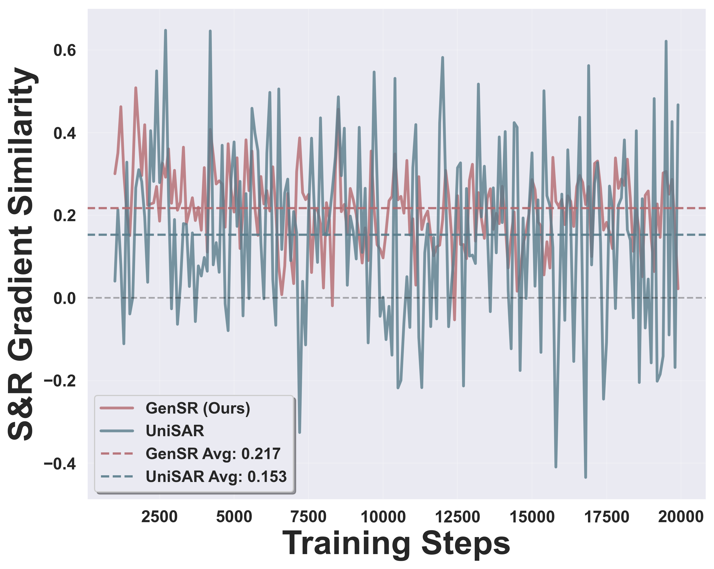

# Gradient Conflict Experiment
In this section, we further evaluate the degree of gradient conflict in both the discriminative paradigm and our proposed method to support that our method alleviates gradient conflict compared to the discriminative paradigm. To assess this effect, we compare our approach with the strongest discriminative baseline, UniSAR.  At each training step, both models are supplied with the same mini-batch.  We then extract the gradients from the same self-attention layer in the transformer encoder, flatten them, and compute their cosine similarity.  A higher cosine value indicates less conflict between the two tasks. Blow figure shows the similarity distribution across the training process.  The similarity curve of our method, GenSR, remains consistently positive and varies smoothly throughout training, whereas the curve for UniSAR exhibits greater oscillation and frequently dips into negative values. The persistent positivity of GenSR's curve suggests that gradients from search and recommendation seldom conflict, while the repeated sign changes in UniSAR indicate recurring opposition between the two tasks. These contrasting trends clearly demonstrate that assigning search and recommendation to distinct subspaces significantly reduces gradient conflict and enables more stable optimization compared to the discriminative paradigm.

